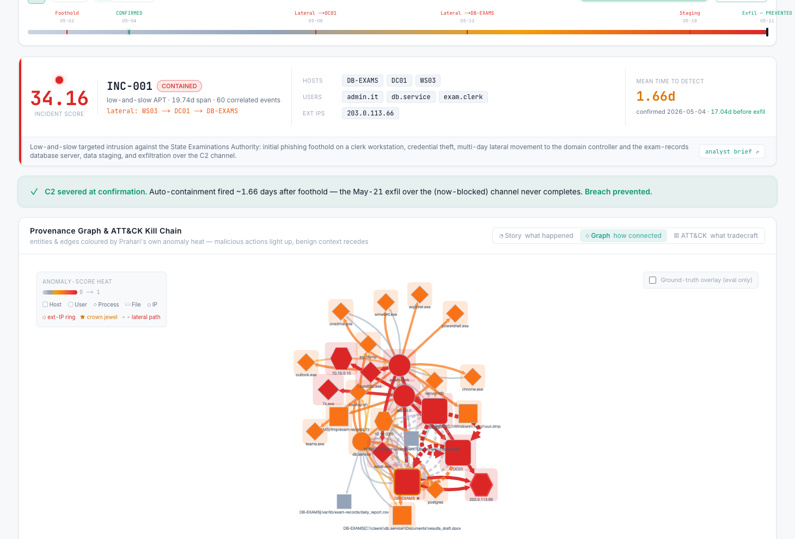

# PRAHARÍ — Executive Summary

**Behavioural Cyber Resilience for Critical National Infrastructure** · PS#7 · https://github.com/Kartik-99999/prahari

**The problem, in one line:** India's critical infrastructure (1.59M CERT-In incidents/yr; AIIMS, CBSE breaches; 70% end-of-life government IT) is defended by signature tools that APTs evade for ~200 days at a time.

**The solution:** one closed, auditable loop — behavioural anomaly detection (no signatures, no labels) → graph fusion of weak signals into a single attack chain → Claude-agent MITRE ATT&CK attribution with next-move prediction → autonomous response behind platform-enforced human gates → a tamper-evident hash-chained audit ledger — fronted by a cinematic SOC console.

## Five headline numbers

| | |
|---|---|
| **1.66 days** | MTTD after foothold (vs ~200-day industry dwell) — containment fires **17 days before** the planned exfiltration: **breach prevented** |
| **0.9988 ROC-AUC · 100% recall @ ~1% FPR** | detection on the controlled 21-day APT scenario — and **0.845 macro ROC on public CIC-IDS-2017** (held-out, unsupervised), reported separately and honestly |
| **92.3%** | MITRE ATT&CK technique-level attribution accuracy, **0 false attributions** |
| **75%** | of the response playbook executes autonomously; the 2 high-impact actions are human-gated **by the platform, not the AI** |
| **Tamper-evident** | every automated action in a SHA-256 hash-chained ledger; a privileged row-rewrite is detected at the exact entry — live demo |

**Generalization, proven:** the *frozen* pipeline (nothing re-tuned) catches a held-out insider attack with no external C2 at **ROC 0.9987, 100% recall @1% FPR, MTTD ~7 min** — and transfers to OT (Modbus/SCADA PLC attack: 3/4 ICS techniques surfaced, MTTD ~4 min). Scale: **~54k events/s at 1M events** on one core. An **independent end-to-end re-run passed every gate** (`VERIFICATION_REPORT.md`).

**Honest scope:** loop metrics are from a controlled synthetic scenario (public-benchmark number reported alongside); Claude agents validated in fallback mode (live run pending); OT modelled synthetically. Roadmap: live-agent run, OT-native features, CERT-In feed, digital-twin simulation, multi-tenant state-CERT deployment.

*Detection in hours, not months — with every autonomous action provable after the fact.*
