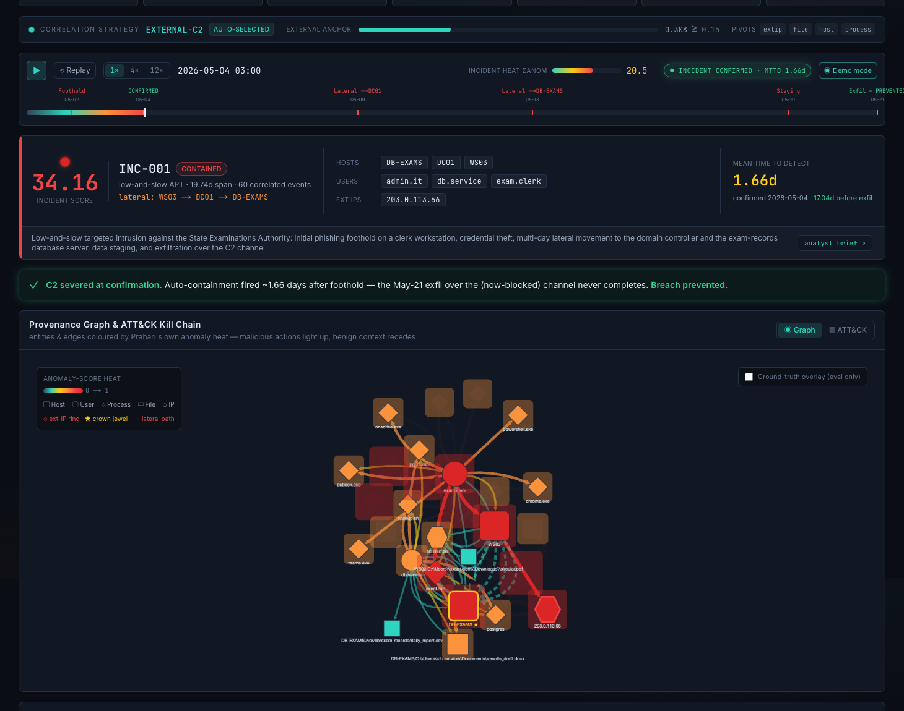
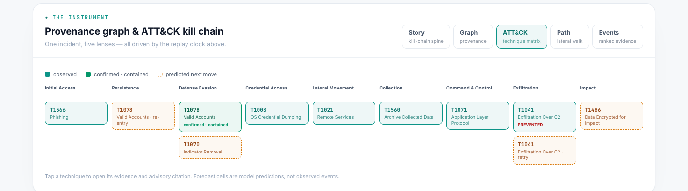

# PRAHARÍ


**Behavioural Cyber Resilience for Critical National Infrastructure.**

PRAHARÍ (Hindi: *guardian / sentinel*) detects behavioural anomalies without signatures, fuses weak signals across a provenance graph into a single ranked attack chain, maps it to MITRE ATT&CK, and orchestrates auditable autonomous response — compressing detection from **weeks to hours**.

> Hackathon Problem Statement #7 — *AI-Driven Cyber Resilience for Critical National Infrastructure.*
> **Every number below was independently re-executed end-to-end and matched:** see [`VERIFICATION_REPORT.md`](VERIFICATION_REPORT.md) (all gates GREEN, live run 2026-06-30).

---

## The problem

CERT-In handled **1.59M+ incidents in 2023**. AIIMS Delhi was paralysed for 2+ weeks by ransomware; CBSE's examination records were breached; **70%+ of Indian government entities run end-of-life IT**. The deeper failure is **detection speed**: APTs run low-and-slow to evade signature tools, and industry mean dwell time is **~200 days** (Mandiant). By the time a signature exists, the attack already succeeded. PRAHARÍ's thesis: **detect behaviour, not signatures.**

## One closed, fully-auditable loop


Detail per stage, event flow, and guardrails: [`docs/ARCHITECTURE.md`](docs/ARCHITECTURE.md).

## Results at a glance

Two classes of result, never conflated — **honesty is a feature** (full methodology in [`docs/RESULTS.md`](docs/RESULTS.md)):

| What | Result | Class |
|---|---|---|
| Detection ROC-AUC | **0.9988** · PR-AUC 0.868 · **100% recall (13/13) @ ~1% FPR** | controlled scenario¹ |
| Public benchmark (CIC-IDS-2017, held-out, unsupervised) | DDoS ROC **0.910** · PortScan 0.781 · macro **0.845** · DDoS **84.6% det @10% FPR** | **public benchmark** |
| Generalization: held-out insider attack, **frozen** thresholds, no external C2 | ROC **0.9987** · **100% recall (45/45) @1% FPR** · MTTD **~7 min** | held-out scenario |
| IT + **OT**: Modbus/SCADA PLC attack — we measured the IT-only gap, then closed it with OT-native behavioural features (G7) | ROC 0.840 → **0.895** · malicious setpoint-writes alarmed **8/16 → 13/16** @1% FPR · MTTD ~4 min | held-out OT scenario |
| ATT&CK attribution (technique level) | **92.3% exact (12/13), 0 false attributions** | controlled scenario¹ |
| SOAR automation coverage | **75%** (6 auto / 2 human-gated of 8 playbook steps) | controlled scenario¹ |
| MTTD after foothold | **1.66 days** (17-day lead before exfil) vs ~200-day industry dwell | controlled scenario¹ |
| MTTR once confirmed | **< 1 s** automated containment | controlled scenario¹ |
| Scale | **~54k events/s end-to-end at 1M events** (single core, full power; ~26k on a throttled laptop — O(1)/event, scales with clock × cores), 2.5 GB RSS | benchmark harness |
| Adversarial probe (attacker evades off-hours signal) | recall@1%FPR collapses to 13% — but ROC holds **0.915**, **80% @5% FPR** — reported honestly | held-out scenario |
| Audit integrity | 10-entry hash chain verified; **tamper demo detects a privileged row rewrite at the exact entry** | live demo |

¹ *Controlled scenario = our own synthetic, labelled 21-day APT (2,128 events / 13 malicious). Near-perfect numbers reflect a clean scenario — which is exactly why we also report the public-benchmark, held-out-generalization, OT, and adversarial numbers above.*

**Counterfactual headline:** containment fires on day **1.7**, severing C2 **17 days before** the scheduled exfiltration — **the breach is prevented.**

A calm, daylight SOC surface built to be *interrogated*, not just read — a top-down verdict that drills all the way to raw evidence. **The page runs on live data:** on load it hydrates from the running BFF (a header badge says **● LIVE · BFF**); if the stack is down it falls back to reconstructed fixtures and says so (**◌ FIXTURES · BFF OFFLINE**) — the console never pretends.

| Story — replay clock + kill-chain spine, confirmed beat | ATT&CK technique matrix |
|---|---|
|  |  |

The page reads top-down like a verdict: a one-sentence **hero** (detected day 1.66 · contained · exfil prevented) over the live metric slate, the **correlation-strategy strip** (the correlator's auto-selected external-C2/insider mode with its measured anchor gauge and pivot set), and a **master replay clock** (May 1 → May 21, real timestamps) that drives everything below it.

Under the clock sits the **instrument** — one incident, seven tabs (everything else on the page stays quiet until asked):

- **Story** — the reconstructed kill chain as a left-to-right spine; each station ignites the moment the playhead crosses its first-observed time, with the **✓ confirmed · contained** and **✕ exfil prevented** verdicts inline — and a **chapter list** underneath: every technique's evidence line, host, first-observed date and anomaly score, one click from the ATT&CK lens.
- **Graph** — the live provenance graph (28 entities / 71 edges), coloured **only** by the system's own anomaly scores: the WS03 → DC01 → DB-EXAMS → C2 spine reads as one bold marching line, benign context recedes; hover spotlights a neighbourhood, click opens the evidence drawer (event id, technique, score, plain-language reasons), and a **top-signals** rail jumps straight to the five loudest edges. Ground-truth overlay stays an **eval-only, off-by-default** toggle (`docs/console_graph.png`).
- **ATT&CK** — observed techniques on their tactics, predicted next moves in a distinct forecast treatment.
- **Path** — the lateral walk to the crown jewel, hop by hop, with the credential that carried each hop.
- **Events** — the ranked raw evidence (real event ids), **filterable** (all / high-anomaly ≥ 0.72 / confirmed · prevented), each row jumping back to its edge in the graph.

- **Response** — the attribution assessment beside the **live SOAR queue**: every action shows the planner's **rationale** and blast radius, and pending human-gated actions carry real Approve/Deny controls that write to the actual append-only ledger.
- **Audit** — the **tamper-evident ledger** rendering the real Postgres entries with their real hashes and **decision column**, a live `verify_chain()` summary with the head hash, plus a clearly-labelled tamper *simulation*.

The **one-page analyst brief** is one click from the verdict. In live mode the header carries **⟳ run fresh attack** — one click replays a fresh seeded intrusion through the entire server-side loop (same as `make attack`, window anchored to today, ~20 s with staged progress), then re-hydrates and auto-replays it; the two human gates come back PENDING for a live approve. The site opens on a **landing page** (`/`) in a calm, sovereign-platform register — dawn-gradient hero, a tabbed live-product demo of the five lenses, gold measured-numbers strip, the closed-loop story and trust guarantees — and hands off to the instrument at **`/console`**. Deep links: `/console?lens=story|graph|attack|path|events|response|audit`, `&day=<n>` (replay position), `?offline=1` (force fixtures); legacy root-level deep links redirect. Detection curves: [`docs/ueba_roc_pr.png`](docs/ueba_roc_pr.png), [`docs/benchmark_cicids_roc_pr.png`](docs/benchmark_cicids_roc_pr.png), [`docs/ot_detection.png`](docs/ot_detection.png).

## What makes it different

- **Graph "anomaly lift" fusion** — `fused = personalized_PageRank / uniform_PageRank` over an event-similarity graph divides out benign-hub bias, so weak-but-connected signals (scores 0.68–0.75) rise to ≥0.90 and assemble into one ranked incident. Individually-ignorable events become one attack chain: **WS03 → DC01 → DB-EXAMS**.
- **Agentic attribution with integrity rails** — Claude agents (attribution + response-planner) reason over a RAG knowledge base of **697 MITRE ATT&CK techniques + curated advisories**, cite-or-abstain, and never see ground truth. Run live either with an `ANTHROPIC_API_KEY` **or** through a Claude Code subscription (`make attribute-agent-live`, no key) — and degrade gracefully to deterministic logic when neither is present. We scored the live runs against ground truth, caught and fixed a citation-grounding bug, and re-measured ([`docs/LIVE_AGENT_RUN.md`](docs/LIVE_AGENT_RUN.md)): the agent now **reliably grounds its citations on the actual malicious events** (vs the mapper's ~2 on the held-out insider case) — a favourable run labels up to 20 exactly, though the exact ATT&CK label on adjacent techniques varies run-to-run — while the **deterministic mapper (92.3%) stays the stable reproducible number**.
- **The AI cannot bypass a human gate** — the response-planner only *proposes* `{action, target, rationale}`; the **platform** computes blast radius and decides the gate. High-impact actions (isolate DB server, disable domain admin) always require one-click human approval.
- **No-leakage discipline, enforced in code** — an `assert_no_leakage` guard blocks ground-truth labels and planted proxies from ever reaching model inputs; the API strips `gt_*` from every response (verified: 0/8 endpoints leak).
- **Tamper-evident audit** — every automated decision lands in a SHA-256 hash-chained, append-only Postgres ledger with a BEFORE UPDATE/DELETE trigger. A privileged insider who rewrites a row is caught by `verify_chain()` at the exact entry — demonstrated live.

## Quickstart

```bash
cp .env.example .env        # optional: add ANTHROPIC_API_KEY for live agents
make up                     # Neo4j + Redis + Postgres (Docker/colima)
make health                 # expect all three OK
make graph-load             # deterministic 21-day scenario (seed 42)
make ueba-score && make fuse && make incidents      # detect → fuse → assemble
make attribute-agent && make respond                # attribute → respond (fallback-safe)
make audit-verify && make audit-tamper-demo         # prove the ledger
make api                    # FastAPI BFF :8000   ·   cd console && npm i && npm run dev  → :3000
```

**Or just watch the whole thing fire in one command (~1 min, no API key):**

```bash
make up && make attack      # replays a fresh intrusion through ingest→detect→correlate→attribute→respond→audit
```
`make attack` prints a staged SOC narrative (the correlator even reports whether it auto-picked external/insider mode); add `LIVE=1` to run the subscription-CLI Claude agent. `make brief` writes a one-page analyst incident brief; **`make stream` scores the intrusion continuously on the wire** (a long-running `events:raw` consumer that ALERTs on the kill chain as events arrive).

Full guide incl. troubleshooting: [`docs/SETUP.md`](docs/SETUP.md). Everything is deterministic (seeded) and reproducible; eval targets: `make ueba-benchmark` (CIC-IDS-2017), `make scenario2` (generalization), `make ot-demo` (OT), `make scale-bench`, `make adversarial`.

**Opt-in advanced ML (default OFF ⇒ verified numbers untouched, measured before/after — [`docs/RESULTS.md`](docs/RESULTS.md) §7):** `PRAHARI_ENSEMBLE3=1` (3rd detector family + degeneracy guard; adversarial evasive ROC 0.915→0.938), **insider-aware fusion is now automatic** — the correlator auto-detects the attack shape and adds the user pivot on an anchorless insider (scenario-2 recall **62→69%**, campaign consolidates 2 incidents→1) while auto-selecting external mode on the APT (zero regression); override with `PRAHARI_INSIDER_FUSION=1/0`. `PRAHARI_SEQ_FEATURES=1` / `PRAHARI_PEER_FEATURES=1` (sequence + peer-group — honest-neutral on our near-ceiling scenarios). We report what moved *and* what didn't.

## Air-gapped / zero-egress mode

Critical-infrastructure networks are frequently air-gapped and legally barred from
calling external APIs — so **the entire detect → respond → audit loop runs with zero
external network dependency.** No Anthropic key, no cloud, no phone-home.

```bash
export PRAHARI_OFFLINE=1     # hard air-gap switch; then run the loop exactly as above
```

- **No LLM required.** Attribution and response fall back to the deterministic
  ATT&CK mapper (92.3% on the controlled scenario) and deterministic playbook;
  `PRAHARI_OFFLINE=1` *forces* fallback even if a key or the Claude CLI is present.
- **RAG is fully local.** The threat-intel store embeds with an on-box scikit-learn
  TF-IDF vectorizer — no ONNX model download — and Chroma telemetry is disabled.
- **ATT&CK KB offline.** Skips the live MITRE STIX fetch and uses the committed
  subset / local cache; the webhook connector refuses all egress.
- **Verified with the network physically blocked** (sockets rejected): KB build,
  RAG build + retrieve, and the full loop all complete. The LLM agent is a strictly
  *optional* enhancement layer for connected deployments. Details: [`docs/AIR_GAPPED.md`](docs/AIR_GAPPED.md).

## Documentation

| Doc | What it covers |
|---|---|
| [`EXECUTIVE_SUMMARY.md`](EXECUTIVE_SUMMARY.md) | One page for a judge who reads nothing else |
| [`docs/RESULTS.md`](docs/RESULTS.md) | Full evaluation report: benchmark, generalization, OT, scale, adversarial — with methodology and honest caveats |
| [`VERIFICATION_REPORT.md`](VERIFICATION_REPORT.md) | Independent live re-run of every gate — all GREEN |
| [`docs/ARCHITECTURE.md`](docs/ARCHITECTURE.md) | The 6-stage loop, datastores, event flow, integrity guardrails, deployment view |
| [`docs/TECHNICAL_DESIGN.md`](docs/TECHNICAL_DESIGN.md) | Deep-dive: UEBA features, graph model, anomaly-lift fusion, agents, SOAR gates, audit chain |
| [`docs/API.md`](docs/API.md) | BFF endpoint reference |
| [`docs/DEMO_SCRIPT.md`](docs/DEMO_SCRIPT.md) | 2.5-minute demo video script + shot list |
| [`docs/AIR_GAPPED.md`](docs/AIR_GAPPED.md) | Zero-egress mode: what runs with no external API, and proof |
| [`docs/sample_incident_brief.md`](docs/sample_incident_brief.md) | Example one-page analyst brief (`make brief`) — why it fired, kill chain, response, assurance |
| [`docs/ROADMAP.md`](docs/ROADMAP.md) | Near-term hardening + platform vision |
| [`SUBMISSION.md`](SUBMISSION.md) | Ready-to-paste hackathon-portal answers |
| [`docs/PRAHARI_Pitch_Deck.pptx`](docs/PRAHARI_Pitch_Deck.pptx) | Designed 12-slide pitch deck |

## Repository map

```
services/   ingest (replay · consumer · stream_scorer) · ueba (features · score · peer) ·
            graph (fuse · incidents) · attribution · soar · report (incident briefs) · api
packages/   schema (OCSF-style SecurityEvent, pydantic) · scenario generators
console/    Next.js 16 SOC console — five-lens incident instrument (components/redesign), live-BFF hydration with fixture fallback
scripts/    health_check · api_smoke · audit_tamper_demo · scale_bench · attack_demo ·
            score_agent_attribution
docs/       results, architecture, design, screenshots, curves, deck
data/       datasets & artifacts (gitignored; fetch steps in data/README.md)
```

**Stack:** Python 3.11+ · scikit-learn + pyod (IsolationForest + ECOD + COPOD, unsupervised) · Neo4j 5 (APOC + GDS) · Redis Streams · Postgres · Anthropic Claude (tool-use agents) · Chroma RAG (local TF-IDF, zero-egress) · FastAPI · Next.js 16 · Docker Compose.

## Honest scope & roadmap

1. The near-perfect loop metrics are on a **controlled synthetic scenario**; the defensible public number is the **CIC-IDS-2017 macro ROC 0.845** (held-out, unsupervised) — both reported, never conflated.
2. The live Claude attribution agent **runs end-to-end** on both scenarios via the Claude Code **subscription CLI** (no `ANTHROPIC_API_KEY` needed) — a real multi-call tool-use investigation. We **scored it against ground truth**, caught it citing *benign* events (0 malicious), fixed the root cause (rank incident events by anomaly score before the model sees them), and re-measured: it now **reliably grounds on the malicious events** — 14–24 of ~25 citations across runs, vs the deterministic mapper's ~2 on the held-out insider case. The *exact* ATT&CK label on adjacent techniques (e.g. T1005⇄T1039) is not stable run-to-run (a favourable run reached 20 exact), so the stable, reproducible number stays the **deterministic mapper (92.3%)** and we report grounding as the robust win. Full before/after + variance: [`docs/LIVE_AGENT_RUN.md`](docs/LIVE_AGENT_RUN.md).
3. **OT/ICS is modelled synthetically** (Modbus/SCADA semantics over OCSF) — no real PLC hardware yet.
4. Depth over breadth: fully-worked incidents, not a broad fleet. See [`docs/ROADMAP.md`](docs/ROADMAP.md).

## Team & license

Built for Hackathon PS#7 (2026) by **Kartik Bhardwaj**, **Harshita**, and **Raghav Sharma**.

Licensed under the [MIT License](LICENSE). Repo: <https://github.com/Kartik-99999/prahari>.
