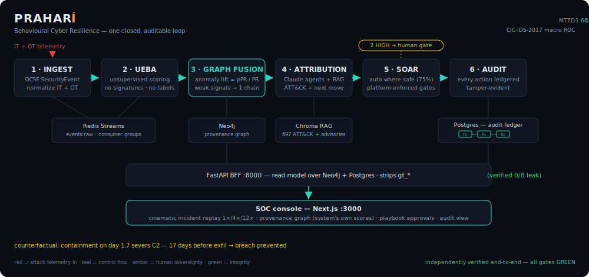

# PRAHARÍ — Architecture

PRAHARÍ is one closed, auditable loop of six stages over three datastores, fronted by a BFF + SOC console. Every stage is a small Python service; every hop is observable; every automated decision is ledgered.



```
            ┌──────────────────────────── CONTROL PLANE ──────────────────────────────────┐
            │                                                                             │
[telemetry] ─► 1 INGEST ─► 2 UEBA ─► 3 GRAPH FUSION ─► 4 ATTRIBUTION ─► 5 SOAR ─► 6 AUDIT │
   OCSF        normalize    score      Neo4j lift        Claude+RAG      gates    hash chain
            │      │           │            │                 │             │         │    │
            │   Redis       (models)      Neo4j            Chroma       (connectors) Postgres
            │  events:raw                                                                  │
            └─────────────► FastAPI BFF (:8000) ──► Next.js SOC console (:3000) ◄──────────┘
```

## Stage-by-stage

### 1 · Ingest / normalize — `services/ingest`
- **Input:** raw endpoint/network/auth telemetry (synthetic generators in `packages/scenario`; deterministic, seeded).
- **What it does:** normalizes everything into one OCSF-style **`SecurityEvent`** (pydantic contract in `packages/schema`) — `activity` ∈ {process, network, auth, file}, actor/src/dst entities, timestamps; domain-specific semantics ride in `raw`. The same schema carries **IT and OT** (Modbus/TCP → `network`:502, engineering-tool runs → `process`, PLC logic → `file`).
- **Transport:** publishes to the Redis Stream **`events:raw`**; downstream consumers attach via **consumer groups** (e.g. group `graph`), giving replayable, at-least-once fan-out — multiple consumers scale horizontally without losing events.
- **Output:** the canonical event stream. Ground-truth labels travel *only* in `event.raw["label"]` and are never read by detection (enforced — see Guardrails).

### 2 · UEBA anomaly scoring — `services/ueba`
- **Input:** `SecurityEvent`s.
- **What it does:** builds streaming per-entity behavioural features (temporal, novelty — *first-time user→host*, *new external dst*, rare process — and velocity; plus OT-native Modbus features — write-flag, first-writer→PLC novelty, write-pair rarity — emitted only for Modbus-bearing streams, G7), then scores **unsupervised**: `anomaly_score = 0.5·model_ensemble + 0.5·novelty`, where the ensemble is IsolationForest(200, seed 42) + ECOD. No signatures, no labels, no thresholds tuned on test data.
- **Output:** per-event `anomaly_score` ∈ [0,1], written onto the graph's relationships.

### 3 · Graph fusion & incident assembly — `services/graph` + **Neo4j**
- **Input:** scored events; the provenance graph (nodes: `Host, User, Process, File, IP`; rels: `AUTH, CONNECTED_TO, STARTED, ACCESSED, ON_HOST, HAS_IP, REACHED`) built idempotently from `events:raw` (full model: [`graph_model.md`](graph_model.md)).
- **What it does:** **"anomaly lift"** — over an event-similarity graph, compute `fused = personalized_PageRank(seeded by anomaly) / uniform_PageRank` (damping `PR_ALPHA = 0.85`). Dividing by the uniform score cancels benign-hub centrality, so weak-but-*connected* malicious events rise. Events with `fused ≥ TAU (0.90)` cluster into **incidents**, ranked by campaign score; the `:REACHED` projection surfaces lateral movement (`WS03 → DC01 → DB-EXAMS`).
- **Output:** ranked incidents (top incident INC-001 scores ≈4× the next) with full event membership and lateral paths.

### 4 · ATT&CK attribution — `services/attribution` + **Chroma RAG**
- **Input:** the top incident's events + scores.
- **What it does:** two paths. (a) A deterministic mapper (92.3% technique accuracy on the controlled scenario). (b) A **tool-using Claude agent** that queries a RAG store (live MITRE ATT&CK STIX — 697 techniques / 222 parents — plus 11 curated advisory docs), must **cite or abstain**, maps each event cluster to technique IDs, and predicts the adversary's next moves (e.g. T1070 log-wiping, T1486 ransomware). The agent never receives `gt_*` fields. It runs live either with an `ANTHROPIC_API_KEY` (Messages API) **or** through a Claude Code subscription (`make attribute-agent-live`, no key), and **degrades gracefully to (a)** when neither is present. Scoring the live runs against ground truth caught it citing benign events; after a grounding fix (rank incident events by anomaly score) it now reliably grounds on the malicious events (vs the mapper's ~2 on the insider case; exact ATT&CK labels vary run-to-run — [`LIVE_AGENT_RUN.md`](LIVE_AGENT_RUN.md)). The **deterministic mapper (a) remains the stable reproducible number**.
- **Output:** technique-annotated incident + predicted next moves → drives the console's ATT&CK frame.

### 5 · SOAR response — `services/soar`
- **Input:** attributed incident.
- **What it does:** a response-planner (Claude agent, same graceful fallback) **proposes** `{action, target, rationale}` per playbook step. The **platform** — not the agent — computes **blast radius** and assigns the gate: LOW/MEDIUM auto-execute (sever C2, block IP, quarantine file…), HIGH (isolate `DB-EXAMS`, disable `admin.it`) require one-click human approval in the console. 6 of 8 steps run autonomously = **75% coverage**. Connectors are simulated except one real, safe, **opt-in** webhook notifier (`make notify`, dry-run by default).
- **Output:** executed/gated actions, each ledgered.

### 6 · Tamper-evident audit — **Postgres**
- **Input:** every automated decision, gate verdict, and human approval.
- **What it does:** appends to a SHA-256 **hash-chained** ledger (`entry_hash = H(prev_hash ‖ payload)`) protected by a BEFORE UPDATE/DELETE trigger (prevention) with `verify_chain()` re-computation (detection). Defense-in-depth: even a privileged insider who disables the trigger and rewrites a row is caught at the exact sequence number — demonstrated by `make audit-tamper-demo`.
- **Output:** verifiable forensic trail; served at `GET /api/audit`.

## Serving layer

- **FastAPI BFF** (`services/api`, :8000) — read model over Neo4j + Postgres: incidents, per-incident graph (nodes+edges for viz), playbook state, metrics slate, audit chain; `POST …/decision` executes a human gate approval and appends a *real* ledger entry. **Strips every `gt_*` field** from responses (verified 0/8 leak).
- **Next.js console** (`console/`, :3000) — a seven-tab incident instrument (Story · Graph · ATT&CK · Path · Events · Response · Audit) driven by one master replay clock (1×/4×/12×). It is a **generic client over the BFF**: an incident picker lists whatever the running system ranked (top incident by default) and everything derives from the selected incident — no scenario is hardcoded. The header badge says **● LIVE · BFF**; if the stack is down the console shows an honest offline state (**no fixtures, no pretending**). The provenance graph is an SVG laid out on the replay clock itself — x is the moment each entity became anomalous, y its type band — colored **only** by the system's own anomaly scores (ground-truth overlay stays an explicit *eval-only* toggle); the **correlation-strategy strip** shows the correlator's auto-selected mode (external-C2 vs insider) with its measured anchor gauge and pivot set; human-gated playbook actions carry real Approve/Deny controls that write to the actual ledger; the tamper-evident audit view renders real hashes with a clearly-labelled tamper *simulation*; the **one-page analyst brief** (`GET /api/incidents/{id}/brief`) is one click from the verdict. A landing page at `/` (sovereign-platform register: dawn-gradient hero, tabbed product demo, gold measured-numbers strip) fronts the instrument at `/console`. Deep links: `/console?incident=<id>&lens=story|graph|attack|path|events|response|audit&day=<n>`; legacy root deep links redirect.

## Integrity guardrails (cross-cutting)

1. **`assert_no_leakage`** — hard assertion that model inputs contain no `label`/`gt_*`/planted `severity` proxy; runs in every scoring path (IT, generalization, OT).
2. **Frozen-threshold evaluation** — held-out scenarios (insider, OT) run through the *unchanged* pipeline: same weights, `TAU`, `PR_ALPHA`; thresholds are reused, never refit.
3. **Platform-enforced gates** — the agent proposes; the platform disposes. The AI cannot lower a gate.
4. **Honest-viz** — the console defaults to system-computed scores; the attack *emerges*, it isn't painted on.
5. **Append-only + hash-chain audit** — prevention *and* detection for the ledger itself.

## Deployment view

```
docker-compose.yml
├── neo4j     :7474/:7687   (+ APOC, Graph Data Science)     — provenance graph
├── redis     :6379         (Streams: events:raw)            — event bus
└── postgres  :5433→5432    (host 5433 to coexist locally)   — audit ledger

Host processes:  make api  (FastAPI :8000)   ·   console/ npm run dev  (Next.js :3000)
Runtime:         Docker Desktop or colima (dev host used colima on macOS)
```

Scale posture (measured, `make scale-bench`): the feature builder is O(1)/event and the scoring core sustains **~54k events/s end-to-end at 1M events on a single core (2.5 GB RSS)** at full power; Neo4j bulk ingest ~55k nodes/s. The absolute rate is single-core and tracks CPU clock (a battery-throttled laptop measures ~26k, uniformly ~2× down — not a regression); the machine-independent claim is O(1)/event + horizontal Redis consumer-group fan-out per stage. Full numbers: [`RESULTS.md`](RESULTS.md) §5.
